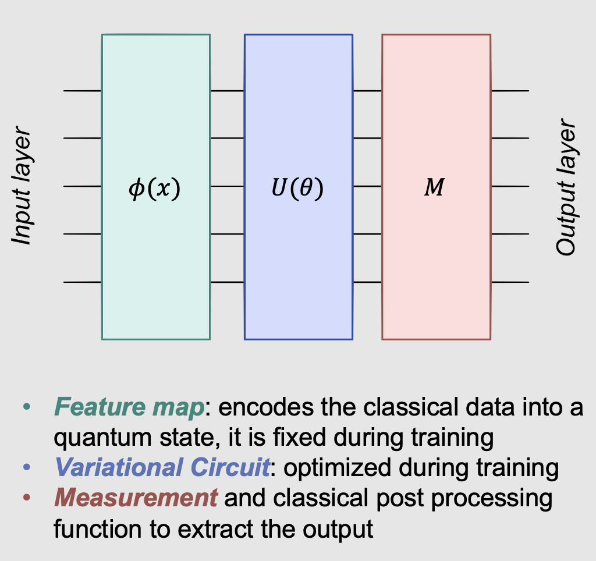
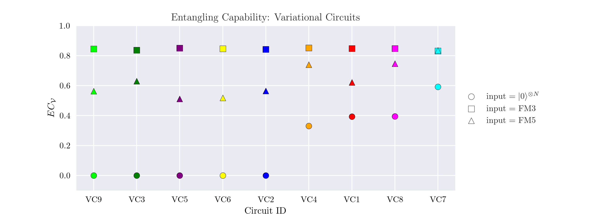
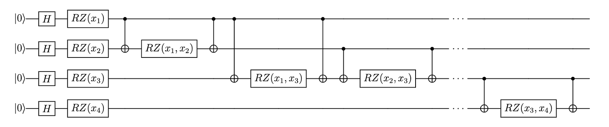

# Quantum Advantage in Machine Learning: Investigating Entanglement and Quantum Feature Maps in Neural Networks
Repository containing the code and final report for my Semester Project titled *"Quantum Advantage in Machine Learning: Investigating Entanglement and Quantum Feature Maps in Neural Networks"* carried out at ETH Scalable Parallel Computing Lab (SPCL) completed in Spring 2023 under the supervision of [Dr. Maciej Besta](https://people.inf.ethz.ch/bestam/) (ETH SPCL) and [Prof. Renato Renner](www.itp.phys.ethz.ch/people/renner/) (ETH Quantum Infromation Theory Group).

The full thesis report can be found [here](Umberto_Borso_Project_Report.pdf).

## Abstract

This work explores different design choices of quantum neural network (QNN) models, focusing on the effect of quantum feature maps and variational circuits on model performance. Their impact on QNN models in terms of capacity and trainability is systematically evaluated using the Fisher information spectrum and the effective dimension, as proposed by Abbas et al. [[1]](#1).

    

Furthermore, the Meyer-Wallach measure, as suggested by Sim et al. [[2]](#2), is employed to quantify the entangling capability of the analysed quantum feature maps and variational circuits. Considering that entanglement is thought to play a pivotal role in achieving quantum advantage [[3]](#3), it is of the uttermost interest to systematically explore this aspect. This investigation aims at understanding the interplay between entanglement descriptors and QNN performance metrics, thereby laying the groundwork for a theoretical framework essential for characterising these key components in quantum machine learning.

    

Among the analysed Pauli feature maps, this study identifies parameter choices $k = 2$, $P_0 = Z$ and $P_{0,1} = ZZ$ as a superior design, exhibiting a high effective dimension and entangling capability, thus affording a potential quantum advantage [[3]](#3). As for variational circuits, particle-preserving designs, employing circular and scalar entanglement patterns demonstrate excellent model performance, and are expected to be well suited for devices with restricted nearest neighbor connectivity [[4]](#4).

    

The findings highlight the crucial role of entanglement in feature map design for effective quantum encoding, while the performance of variational circuits relies on their efficient transformation of the quantum state using parameterised gate operations. These results indicate the necessity of prioritising entangling capability in the design of quantum feature maps to achieve optimal QNN models.

## References
<a id="1">[1]</a> 
Amira Abbas, David Sutter, Christa Zoufal, Aurelien Lucchi, Alessio Figalli, and Stefan
Woerner. The power of quantum neural networks. Nature Computational Science, 1(6):403–
409, jun 2021.

<a id="2">[2]</a> 
Sukin Sim, Peter D. Johnson, and Alá n Aspuru-Guzik. Expressibility and entangling capa-
bility of parameterized quantum circuits for hybrid quantum-classical algorithms. Advanced
Quantum Technologies, 2(12):1900070, oct 2019.

<a id="3">[3]</a> 
Vojtěch Havlíček, Antonio D. Córcoles, Kristan Temme, Aram W. Harrow, Abhinav Kandala,
Jerry M. Chow, and Jay M. Gambetta. Supervised learning with quantum-enhanced feature
spaces. Nature, 567(7747):209–212, mar 2019.

<a id="4">[4]</a> 
Roberto Stassi, Mauro Cirio, and Franco Nori. Scalable quantum computer with supercon-
ducting circuits in the ultrastrong coupling regime. npj Quantum Information, 6(1):67, 2020.